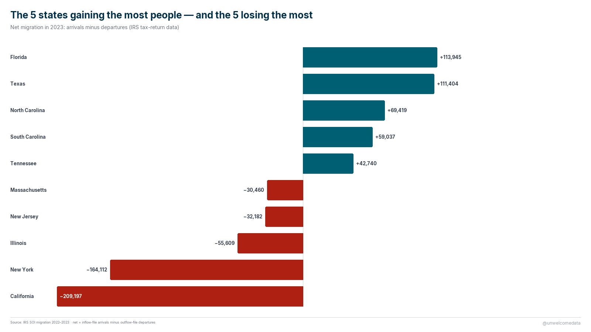
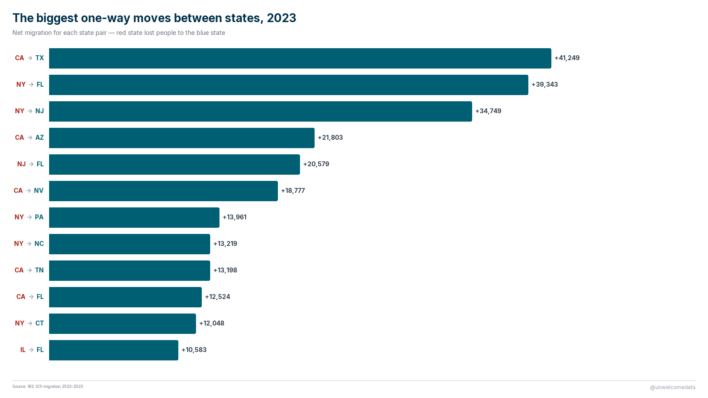
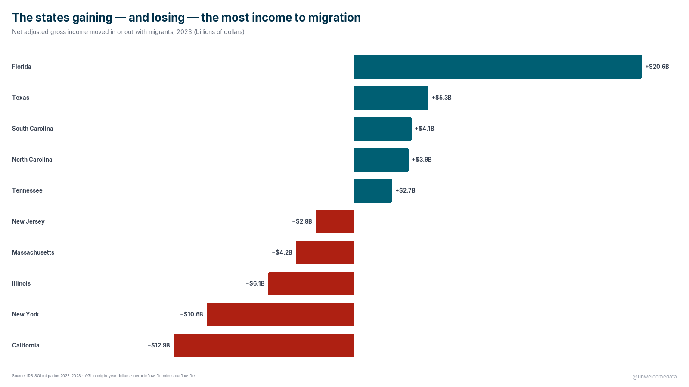
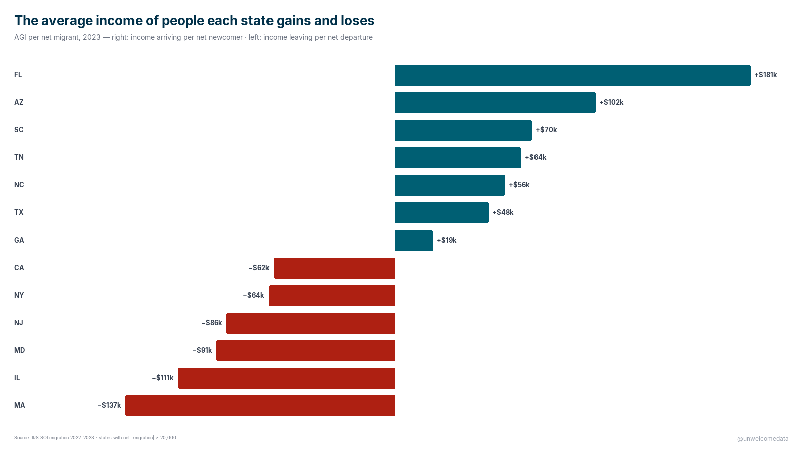
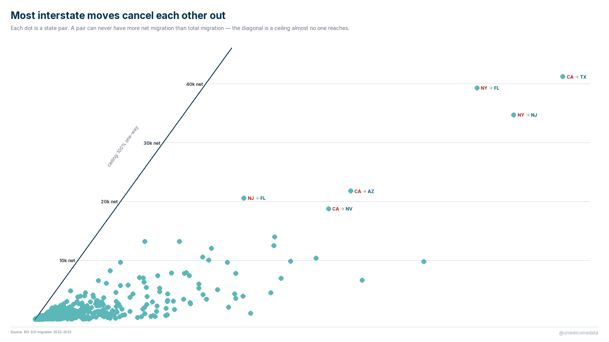

**[@unwelcomedata](https://unwelcomedata.github.io/state-migration/)** · data from public sources

# Where Americans moved between states — and the income that moved with them

State-to-state migration for 2023, measured two ways at once: **who** moved
(Census ACS survey, people-weighted) and **how much income** moved with them (IRS
tax-return data, income-weighted). Putting both next to each other is the point —
they answer different questions and shouldn't be blended into one number.

**The findings that held up:**

- **Florida and Texas gained the most people; California and New York lost the
  most.** Florida also gained the most *income*, on the order of +$20 billion in
  adjusted gross income for the year; California and New York each shed north of
  $10 billion.
- **Most interstate movement cancels out.** Roughly nine out of ten moves between
  states are offset by moves in the opposite direction — the median state's *net*
  migration is only about 9% of its *gross* churn. The headline "net" numbers ride
  on top of a much larger two-way flow.
- **The income a state gains per net migrant varies enormously.** Florida gained
  roughly $181,000 of AGI per net migrant (high earners moving in); some states
  lost well over $100,000 per net departure.

---

## The charts

**The 5 states gaining the most people — and the 5 losing the most.** Net
migration, 2023.

**The biggest one-way moves between states.** The largest *net* directed pairs —
where one state consistently drained into another.

**The states gaining — and losing — the most income to migration.** Net adjusted
gross income (IRS), 2023.

**The average income of the people each state gains and loses.** Net AGI divided
by net migrants — a per-person read on who's arriving vs. leaving.

**Most interstate moves cancel each other out.** Net migration against gross
churn, showing how little of the movement nets out.

---

## How it was measured

Two federal sources, kept side by side rather than merged:

- **IRS Statistics of Income (SOI)** — built from *tax returns*. A change of state
  between two filing years counts as a move. It's income-weighted (it carries AGI)
  but its universe is **tax filers and their dependents**, not everyone.
- **Census ACS** — a *survey* ("where did you live one year ago?"). It's
  people-weighted and captures everyone regardless of tax status, but every
  estimate carries a margin of error, and small flows are unreliable.

The two correlate strongly (Pearson r ≈ 0.86) but measure different universes, so
the dataset reports both columns and never reconciles them to a single figure.

**Caveats that materially affect interpretation:**

- **"Net" here uses the IRS convention** (arrivals from the inflow file minus
  departures from the outflow file). It's the more legible story, but it doesn't
  reconcile to exactly zero across all states (a residual on the order of tens of
  thousands, from a few one-sided edges). Stated plainly so the totals aren't
  over-read.
- **IRS counts filers + dependents, not total population**, and its AGI is income
  *at the origin*, in that year's thousands of dollars — it's not the mover's later
  earnings.
- **The published data spans 2011–2024**, but this release's story is the **2023**
  single year. IRS has methodology **series breaks at 2011–12 and 2022–23**, and
  ACS **has no 2020 release** and a known **2022 Connecticut** error — so any
  multi-year comparison must carry those caveats. 2023 alone crosses none of them.
- **County-level migration is not part of this release.** It's ingested and
  validated but held for a later phase (county flows undercount by design — small
  flows are suppressed).

Per-source collection methods, definitions, series breaks, and the full column
glossary are in [SOURCES.md](SOURCES.md).

---

## The data

The published dataset is in [`export/`](export/):

- `state_migration_flows_v1.csv` — directed state-to-state flows with both the IRS
  (returns, individuals, AGI in/out) and ACS (migrants, margin of error) measures
  side by side, 2011–2024.
- `state_migration_flows_v1_codebook.md` — a plain-English description of every
  column.

The richer packaging (Excel, Parquet) and the full pipeline code are in the repo.

---

## Reproduce it

**This one is not a one-command rebuild.** The IRS SOI files (state CSVs) and the
Census ACS migration tables (Excel) are downloaded from the URLs in
[SOURCES.md](SOURCES.md) into `data/raw/`. The ingest → clean → prepare pipeline
then builds the DuckDB tables and the export; the reusable logic lives in
[`src/`](src/) (`ingest.py`, `clean_quality.py`, `prepare.py`, `viz_social.py`).

For exploring the built database directly, [`queries/example_queries.sql`](queries/example_queries.sql)
has read-only reference queries (table list, provenance, top net gainers/losers,
income-per-migrant) that run against the project DuckDB file.

---

## Sources & license

Full attribution — publisher, URL, collection method, definitions, series breaks,
and known controversies — is in [SOURCES.md](SOURCES.md). In short: IRS Statistics
of Income migration data and U.S. Census Bureau ACS state-to-state migration flows,
both U.S. government works in the public domain. No crowd-edited sources are used.

---

## Further exploration

- A **multi-year time series** (2011–2024) of net migration, carrying the IRS and
  ACS series-break caveats — does the Florida/Texas trend accelerate, and where's
  the COVID bump?
- **Stayers vs. leavers income**: do the people leaving a state earn more or less
  than those who stay?
- The **county layer** (LA County outlier, affordability migration to below-median
  counties, a metro-level view) — held for a phase-2 release.

---

> **AI-Assisted Development**
> This project was built with the assistance of [Kiro](https://kiro.dev), an
> AI-powered development environment. All data-sourcing decisions, methodology
> choices, and published findings are the responsibility of the author. AI was
> used for code generation, data-pipeline construction, and research assistance —
> not for analysis conclusions or editorial judgment.
